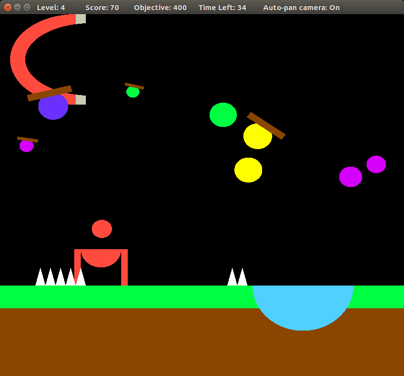

# Pacman Killer

This is a 2-D Arcade Game inspired from the original [pacman killer](https://www.webpacman.com/pacmankiller.html) game. The player controls a metal ball and uses it to land on and
destroy other flying balls constantly traversing the screen from left to right. The objective of the
game is to kill as many flying balls as possible within the time limit.  


<br><br>

## Building and Execution
```
mkdir build
cd build/
cmake ..
make
./pacman_killer
```

## Controls
- A - Move Left
- D - Move Right
- Space - Jump
- Mousewheel - Zoom
- Arrow Keys - Pan
- P - Pause Game
- L - Enable/Disable auto-panning of camera

## Scoring
- Blue Ball: +5 points
- Green Ball: +10 points
- Purple Ball: +15 points
- Yellow Ball: +20 points
- Porcupine: -20 points
## Features
- **Flying balls​** of different colours will traverse the screen above the ground at random
heights from left to right. Some of the balls have a rectangular slab
attached at different angles. If you land on these **slopes** you would be launched at an
angle of reflection from the perpendicular to the slab following the laws of reflection.
- Landing on a ball will provide a boost to the player in the upward direction.
- A​ **magnet**​ would appear and disappear randomly which will give the player ball a horizontal acceleration.
- A ​**pond**​ , entering which the player’s motion will be slowed down and the jump
will be shorter.
- Some ​ **spiked porcupines**​ , which will result in a penalty if the player hits them.
- ​ **Trampolines**​ are placed at some locations. They provide a higher jump than usual.
- **Automatic camera panning** following ball motion and option to disable it.
